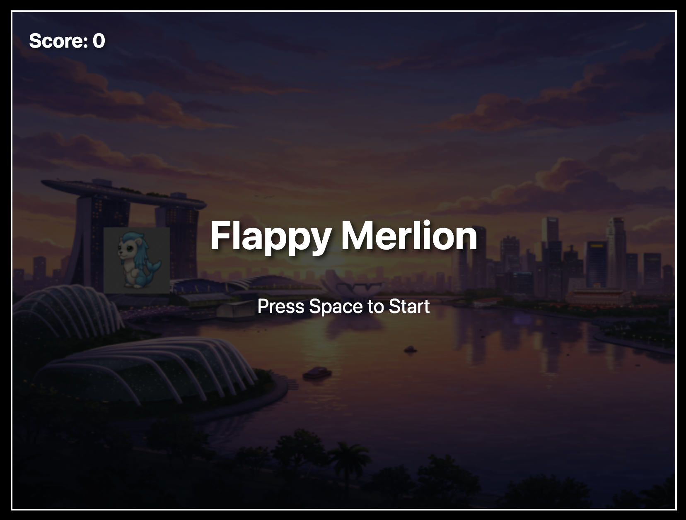

# Flappy Merlion - A Vibe Coded Game Demo

<p align="center">
  
</p>

This project is a simple "Flappy Bird" style game created to demonstrate the capabilities of the [Gemini CLI](https://github.com/google-gemini/gemini-cli) and [Gemini Code Assist with Agent Mode](https://codeassist.google.com)for rapid, "vibe-driven" development. The entire game, from asset generation to coding and version control, was built by Gemini-2.5-pro and these agents.

## About the Game

"Flappy Merlion" is a classic side-scrolling game where the player controls the Singapore Merlion, navigating it through a series of futuristic skyscraper obstacles. The goal is to fly as far as possible without colliding with the obstacles or the ground.

**Controls:**

- **Spacebar:** Press to make the Merlion "flap" upwards.

## Tech Stack

- **Frontend:** HTML, CSS, and vanilla JavaScript
- **Graphics:** [Three.js](https://threejs.org/) for 2D rendering on a WebGL canvas.
- **Asset Generation:** All visual assets (Merlion, obstacles, background) were created using Google's [Imagen](https://deepmind.google/technologies/imagen/) text-to-image model.

## Purpose of this Demo

This repository serves as a practical example of how to use the Gemini CLI as a software engineering assistant. Key development activities performed by the agent include:

- **Project Scaffolding:** Creating the initial file structure (`index.html`, `style.css`, `game.js`).
- **Asset Generation:** Writing prompts for `imagen` to generate all necessary game art.
- **Coding:** Writing the complete HTML, CSS, and JavaScript code for the game, including game logic, UI, and state management.
- **Version Control:** Committing changes to the Git repository with descriptive messages.
- **Documentation:** Generating this `README.md` file and updating the `task.md` progress tracker.

## How to Run

1.  Clone this repository.
2.  Since the game is built with simple HTML, CSS, and JS, you only need a local web server to run it. A common way to do this is with Python's built-in server.
3.  Navigate to the project's root directory in your terminal and run:

    ```bash
    python -m http.server
    ```

4.  Open your web browser and go to `http://localhost:8000`. The game should load and be ready to play.

---

This project showcases a modern, AI-assisted workflow for quickly prototyping and building applications.
